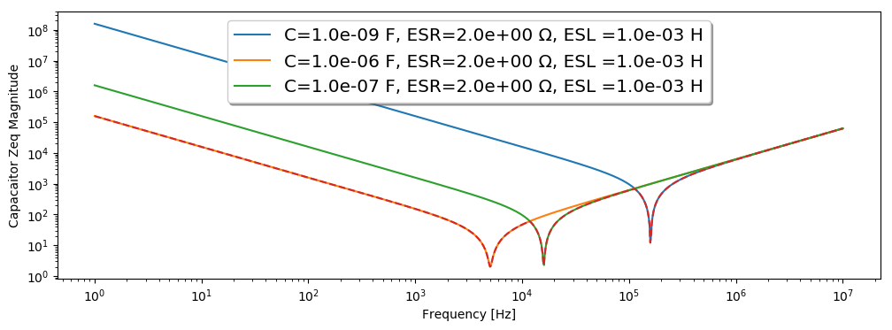

# Electrical-Engineering-notes

Colection of Jupyter Notebooks linked to electrical and electronics design

### Bypass capacitor calculator

**Principle**

$Z_{eq} = ESR + \frac{1}{jwC} + jwL $ 

**Results**

